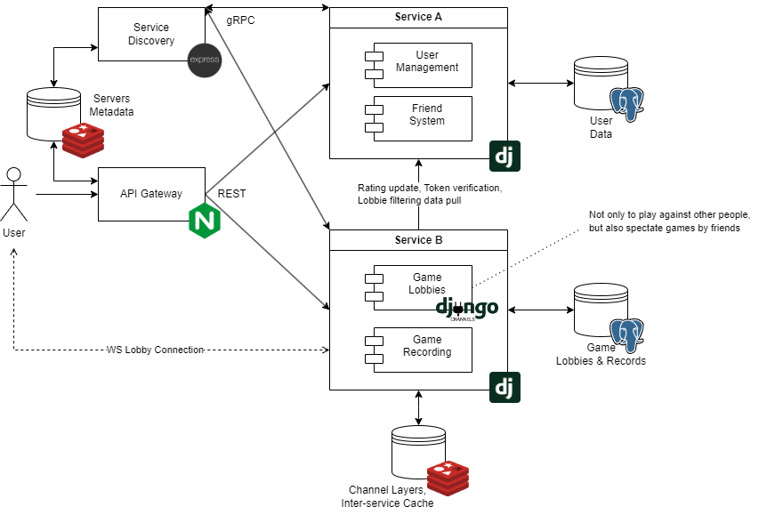

## Microservice-based Chess Website

### Application Suitability Assessment

1. Chess websites may experience different levels of traffic in different parts of the system, for example during tournaments, live broadcasts, or when new features are released. Microservices allow **to independently scale** high-load services without affecting other parts of the system.\*
2. Microservices enable working on independent features or services without stepping on each other’s toes. It becomes possible **to update or deploy individual services** without redeploying the entire application.

- e.g., _Chess.com_ separates its puzzle generator, allowing a dedicated team to work on improving it, deploy new algorithms, or fix bugs without disrupting other critical services like matchmaking or game analysis.

### Service Boundaries

- Service A handles everything regarding the **user data**: authentication, friend system, rating
- Service B handles everything related to the **games played** on the website: lobbies (including spectators), moves recording; also requests rating updates and new friend requests from A

### Technology Stack and Communication Patterns

- Service A (**Python**): **Django** + **PostgreSQL**
- Service B (**Python**): **Django** + **PostgreSQL** + **Dj Channels** (WS) + **Redis** (Channel Layers) + * Native Django cache
- API Gateway (**JS**): **Express** + **Redis** (servers metadata src.)
- Service Discovery (**JS**): **Express** + **Redis** (servers metadata dst.)
- Inter-service communication: RESTful APIs (CRUD) and gRPC (service discovery)

### Data Management Design (Main Endpoints)

- Service A endpoints (**DONE**):

1.  POST | /api/authen/signup/ - creates a new account

        expects:
        {
            "username': string,
            "password': string
        }

        on_succ: a confirmation message

2.  POST | /api/authen/signin/ - logs into an existing account

        expects:
        {
            "username': string,
            "password': string
        }

        on_succ:
        {
            "refresh": string,
            "access": string
        }

3.  GET | /api/friends/search/?uname= - searches users by username

        expects: parameters in URL

        on_succ:
        [
            {
                "id": int-id,
                "username": string,
                "rating": int
            },
        ] - a list of matches

4.  POST | /api/friends/requests/open/?to= - creates a friend request

        expects: auth. token, parameters in URL

        on_succ: a confirmation message

5.  GET | /api/friends/requests/list/my/ - gets all incoming friend requests

        expects: auth. token

        on_succ:
        [
            {
                "id": int-id,
                "username": string
            }
        ] - a list of users requesting friendship

6.  POST | /api/friends/requests/resolve/?id=&accepted= - resolves a friend request

        expects: auth. token, parameters in URL

        on_succ: a confirmation message

7.  PATCH | /api/users/rating/upd/?id=&delta= - updates user's rating

        expects: parameters in URL, inter-service authorization credentials (B -> A)

        on_succ: a confirmation message

- Service B endpoints (**DONE**):

1.  POST | /api/records/save - saves a record of moves

        expects: auth_token,
        {
            "moves": list(string)
        }

        on_succ: a confirmation message

2.  GET | /api/records/get-all - gets all the records' id-s and datetime data

        expects: auth_token

        on_succ:
        [
            {
                "id": int-id,
                "datetime": string-serialized
            }
        ] - a list of records

3.  GET | /api/records/get/<int:id> - get an actuall record by id

        expects: auth_token, number id (record's id)

        on_succ:
        {
            "moves": list(string)
        }

4.  POST | /api/games/create - creates a new lobby

        expects: auth_token

        on_succ:
        {
            "lobby_id": int-id
        }

5.  GET | /api/games/discover - gets a list of lobbies to join (filtered by rating/friends)

        expects: auth_token

        on_succ:
        [
            "lobby_id": int-id,
            "avg_rating": int,
            "friends_in": bool
        ]

6.  Django Channels AsyncJsonWebsocketConsumer | ws://.../lobby/<string:lobby_identifier> - lobby consumer (removed on empty); receives streams of data to be deserialized, processes it in the specified way

### Deployment & Scaling

Usage of Docker (containerization), Docker Compose (running multi-container applications)
