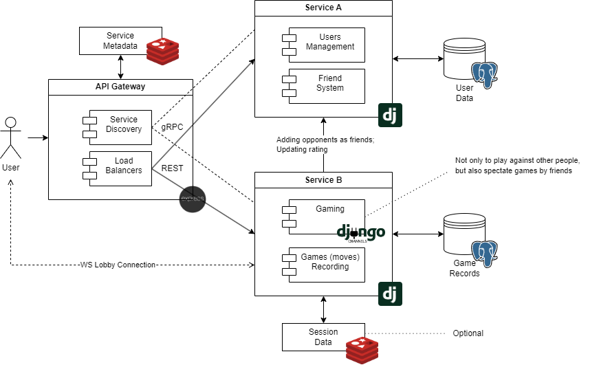

## Microservice-based Chess Website

### Application Suitability Assessment

1. Chess websites may experience different levels of traffic in different parts of the system, for example during tournaments, live broadcasts, or when new features are released. Microservices allow **to independently scale** high-load services without affecting other parts of the system.\*
2. Microservices enable working on independent features or services without stepping on each other’s toes. It becomes possible **to update or deploy individual services** without redeploying the entire application.

- e.g., _Chess.com_ separates its puzzle generator, allowing a dedicated team to work on improving it, deploy new algorithms, or fix bugs without disrupting other critical services like matchmaking or game analysis.

### Service Boundaries

- Service A handles everything regarding the **user data**: authentication, friend system, rating
- Service B handles everything related to the **games played** on the website: lobbies (including spectators), moves recording; also requests rating updates and new friend requests from A

### Technology Stack and Communication Patterns

- Service A (**JS**): **Express** + **MongoDB** (a common combination)
- Service B (**Python**): **Django** + **PostgreSQL** (a common combination) + **Dj Channels** (WS) + **Redis** (Channels storage)
- API Gateway (**Go**): **Fiber**
- Inter-service communication: RESTful APIs and gRPC

### Data Management Design

- Service A endpoints:

1.  /api/users/auth/signup - creates a new account

        expects:
        {
            string username,
            string password
        }

        on_succ: a confirmation message

2.  /api/users/auth/signin - logs into an existing account

        expects:
        {
            string username,
            string password
        }

        on_succ:
        {
            string auth_token
        }

3.  /api/users/friends/search?uname= - searches users by username

        expects: auth_token, parameters in URL

        on_succ:
        [
            {
                number id,
                string username
            },
        ] - a list of matches

4.  /api/users/friends/req/<int:id> - creates a friend request

        expects: auth_token, number id (receiver)

        on_succ: a confirmation message

5.  /api/users/friends/get - gets all existing friend requests

        expects: auth_token

        on_succ:
        [
            {
                number id,
                string username
            }
        ] - a list of users requesting friendship

6.  /api/users/friends/add?id=&accepted= - resolves a friend request

        expects: auth_token, parameters in URL

        on_succ: a confirmation message

7.  /api/users/ratings/upd?id=&del= - updates user's rating

        expects: parameters in URL, authorization credentials (inter-service communication: B -> A)

        on_succ: a confirmation message

- Service B endpoints:

1.  /api/records/save - saves a record of moves

        expects: auth_token,
        {
            list(string) moves
        }

        on_succ: a confirmation message

2.  /api/records/get-all - gets all the records' id-s and datetime data

        expects: auth_token

        on_succ:
        [
            {
                number id,
                string datetime (serialized)
            }
        ] - a list of records

3.  /api/records/get/<int:id> - get an actuall record by id

        expects: auth_token, number id (record's id)

        on_succ:
        {
            'moves': list(string)
        }

4.  /api/games/create - creates a new lobby

        expects: auth_token

        on_succ:
        {
            number lobby_id
        }

5.  /api/games/discover - gets a list of lobbies to join (filtered by rating/friends)

        expects: auth_token

        on_succ:
        [
            number lobby_id,
            number avg_rating,
            bool friends_in
        ]

6.  wss://.../api/games/wss/lobby/<int:id> - lobby consumer (removed on empty)

        A Django Channels JSONConsumer - receives streams of data to be deserialized, interpret it in the specified way

### Deployment & Scaling

Usage of Docker, Docker Compose, Kubernetes, and stuff
