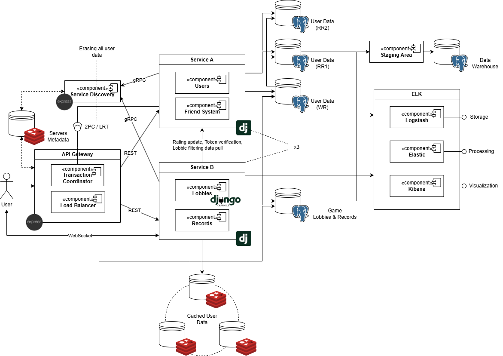

# Microservice-based Chess Website

**In order to run the app**, have Docker installed on your machine and execute the following command:
```
docker-compose -f docker-compose.yml -f docker-compose.secrets.yml up --build
```

**In order to run the tests** for sA:

1. Create a virtual environment


        python -m vevn env

2. Activate it


        For Linux:   source env/bin/activate
        For Windows: env\Scripts\activate

3. Install the dependencies


        pip install -r sa/requirements.txt

4. Run the tests


        python sa/manage.py test

## Application Suitability Assessment

1. Chess websites may experience different levels of traffic in different parts of the system, for example during tournaments, live broadcasts, or when new features are released. Microservices allow **to independently scale** high-load services without affecting other parts of the system.\*
2. Microservices enable working on independent features or services without stepping on each other’s toes. It becomes possible **to update or deploy individual services** without redeploying the entire application.

- e.g., _Chess.com_ separates its puzzle generator, allowing a dedicated team to work on improving it, deploy new algorithms, or fix bugs without disrupting other critical services like matchmaking or game analysis.

## Service Boundaries (OLD)


- Service A handles everything regarding the **user data**: authentication, friend system, rating
- Service B handles everything related to the **games played** on the website: lobbies (including spectators), moves recording; also requests rating updates and new friend requests from A

## Technology Stack and Communication Patterns

- Service A (**Python**): **Django** + **PostgreSQL**
- Service B (**Python**): **Django** + **PostgreSQL** + **Dj Channels** (WS) + **Redis** (Channel Layers) + * Native Django cache
- API Gateway (**JS**): **Express** + **Redis** (servers metadata src.)
- Service Discovery (**JS**): **Express** + **Redis** (servers metadata dst.)
- Inter-service communication: RESTful APIs (CRUD) and gRPC (service discovery)

## Data Management Design (Main Endpoints)

### Service A endpoints:

1.  POST - /api/authen/signup - creates a new account

        expects:
        {
            "username': string,
            "password': string
        }

        on_succ: a confirmation message

2.  POST - /api/authen/signin - logs into an existing account

        expects:
        {
            "username': string,
            "password': string
        }

        on_succ:
        {
            "refresh": string,
            "access": string
        }

3.  GET - /api/friends/search?uname= - searches users by username

        expects: query param

        on_succ:
        [
            {
                "id": int-id,
                "username": string,
                "rating": int
            },
        ]
        - a list of matches

4.  POST - /api/friends/requests/open?to= - creates a friend request

        expects: auth. credentials (jwt in Authorization header), query param

        on_succ: a confirmation message

5.  GET - /api/friends/requests/list/my - gets all incoming friend requests

        expects: auth. credentials (jwt in Authorization header)

        on_succ:
        [
            {
                "id": int-id,
                "username": string
            }
        ]
        - a list of users requesting friendship

6.  POST - /api/friends/requests/resolve?id=&accepted= - resolves a friend request

        expects: auth. credentials (jwt in Authorization header), query params

        on_succ: a confirmation message

### Service B endpoints:

1.  POST - /api/records/save - saves a record of moves

        expects: auth. credentials (jwt in Authorization header),
        {
            "white_player": string-uname,
            "black_player": string-uname,
            "moves": list(string)
        }

        on_succ: a confirmation message

2.  GET - /api/records/list?uname= - gets all the records of the games player by a user

        expects: query param

        on_succ:
        [
            {
                "id": int-id,
                "white_player": string-uname,
                "black_player": string-uname,
                "moves": list(string),
                "datetime": string-datetime-serialized
            }
        ]
        - a list of records

4.  POST - /api/lobbies/create - creates a new lobby

        expects: auth. credentials (jwt in Authorization header)

        on_succ:
        {
            "lobby": {
                "connect_url": string
            },
            "access": string-token
        } 
        - a string for directing all the ws connections to a lobby to a single instance and a refreshed token to be used during the game

5.  GET - /api/lobbies/discover/(rating/friends) - gets a list of lobbies to join filtered by rating/friends

        expects: auth. credentials (jwt in Authorization header)

        on_succ:
        [
            "id": int-id,
            "players": list(int-id),
            "spectators": list(int-id),
            "avg_rating": int
        ]

6. PATCH - /api/lobbies/connect?lobby_id=&is_player= - registers the user in the selected lobby and provides ws connection string and a refreshed token

        expects: auth. credentials (jwt in Authorization header)

        on_succ:
        {
            "lobby": {
                "connect_url": string
            },
            "access": string-token
        }

6.  Django Channels AsyncJsonWebsocketConsumer - ws://localhost:<int:instance_port>/lobby/<string:lobby_identifier> - lobby consumer (removed on empty); receives streams of data to be deserialized, processes it in the specified way

### Deployment & Scaling

Usage of Docker (containerization), Docker Compose (running multi-container applications) - look in the .yml files.

###  Service Boundaries (NEW)

I am planning on expanding the system:



1. Implement **read replication** for user data by setting up two dedicated read replicas to distribute and balance query load.
2. Employ a **Two-Phase Commit (2PC)** and **Long-running Transactions** mechanisms, managed by a Transaction Coordinator within the API Gateway, to ensure safe and atomic deletion of user data, removing all associated records and deregistering the user from any lobbies they participated in.
3. Integrate a **Data Warehouse** to enable comprehensive analysis of user performance, supporting strategic insights and metrics.
4. Deploy the **ELK stack** to centralize and process logs across all system instances, enhancing monitoring and troubleshooting capabilities.
5. Deploy a Redis cluster to enable sharded caching of user data using **consistent hashing**.
